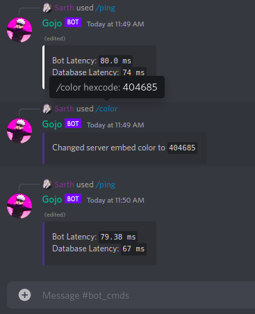

[/home](index.rst)/admin | [source](https://github.com/sarthhh/gojo/blob/main/src/extensions/admin.py)

# ADMIN COMMANDS
Admin commands for configuring bot's behaviour in server.

--------

## /color
 Change the embed colors for messages sent by the bot in the server.

**Arguments**: 
`hexcode` (The hexcode of the new color for bot's embeds.)

SYNTAX : `/color FFFFFF`

--------

## /configs
The base command to check configurations for the server.

**Subcommands**:

`/configs welcome` : Show welcome configurations for the server.

 

`/configs goodbye` : Show goodbye configurations for the server.

`/configs starboard` : Show starboard configurations for the server.

------

[NEXT](greetings.md)