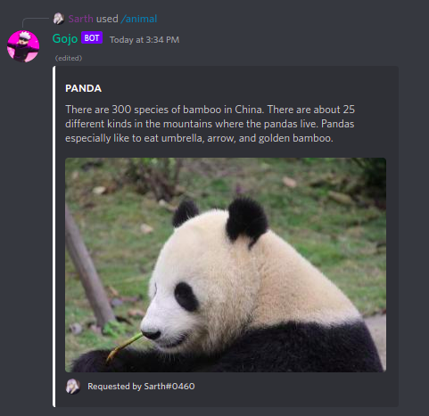

[/home](index.rst)/fun | [source](https://github.com/sarthhh/gojo/blob/main/src/extensions/fun.py)

# FUN COMMANDS

Commands like memes, image manipulation etc have been added to this category

------

## /meme

Gets a random meme from reddit.

------

## /animal

Choose from a set of animals and get a random picture and fact about that animal.

