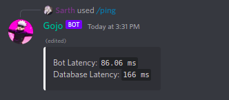

[/home](index.rst)/general | [source](https://github.com/sarthhh/gojo/blob/main/extensions/general.py)

# GENERAL COMMANDS
General bot commands usable by all users.

--------

## /ping

Returns the bot's latency in milliseconds.

-------

## /avatar

Returns the avatar of the mentioned user or command author if no user is supplied.

----

## /vote

Vote for the bot on bot lists.

