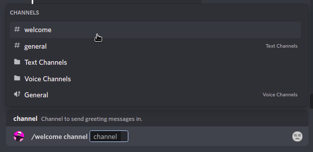
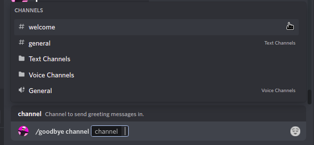
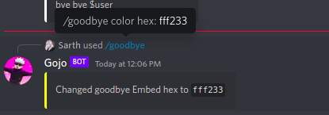

[/home](index.rst)/greetings | [source](https://github.com/sarthhh/gojo/blob/main/src/extensions/greetings.py)

# GREETING COMMANDS
Welcome/Leave module to greet new users and goodbyes.

This module allows you to configure welcome and leave channels, messages etc, which get triggered when a member joins or leaves/


--------

## /welcome

Welcome commands to greet new members joining your server. This can be configured anytime.

These commands require `Manage Server` permissions to run.

**Subcommands :**

`/welcome channel`: Set/Change welcome channel.



`/welcome message` : Setup your own welcome message.


`/welcome color` : Change the color of welcome embeds.


`/welcome remove` : Remove all welcome related data for the server.

--------

## /goodbye

Goodbye commands to send messages when someone leaves the server, setup is similar to welcome commands.

`/goodbye channel` : Change/set goodbye channel.



`/goodbye message` : Setup your own goodbye message.


`/goodbye color` : Change the color of goodbye embeds.



`/goodbye remove` : Remove all goodbye related data for the server.

-------

## /greetingvariables

Variables allowed in welcome/goodbye messages

```bash
$user : Name and tag of the User [ Sarth#0460 ]
$usermention : Mention of the new Member [ <@!580034015759826944> ]
$userid : Id of the Member [ 580034015759826944 ]
$username : Username of the Member [ Sarth ]
$userdiscrim / $userdiscriminator : Discriminator of the User [ 0460 ]
$server / $servername : Name of the Server [ servername ]
$membercount : Membercount of the Server [ 69 ] 
```
------

[NEXT](starboard.md)

