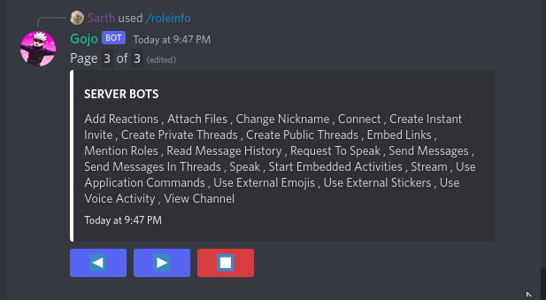
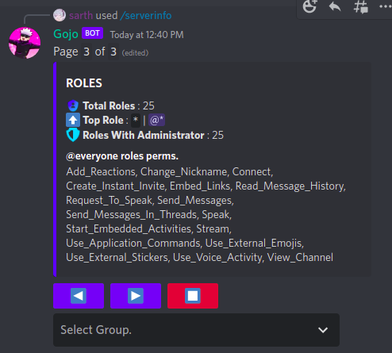
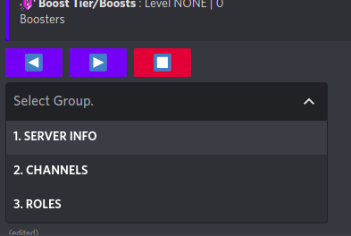

[/home](index.rst)/info | [source](https://github.com/sarthhh/gojo/blob/main/extensions/info.py)

# INFO COMMANDS

This module has commands used to get information about server entities like roles, members, channels etc.

-----

## /userinfo

Get information about a member in the server.

-----

## /roleinfo

Get information about the mentioned role.

----

## /serverinfo

Brief info about the server and its objects.

----

[NEXT](admin.md)