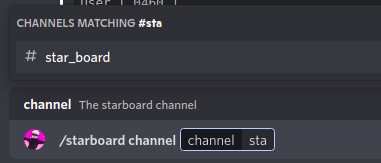
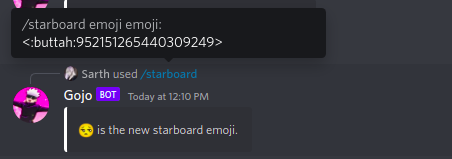

[/home](index.rst)/starboard | [source](https://github.com/sarthhh/gojo/blob/main/src/extensions/starboard.py)

# STARBOARD COMMANDS

Setup a starboard for your server to save memorable messages.

------

## /starboard
Starboard commands to configure starboard commands.

`/starboard channel` : Set/Change The starboard Channel.

`/starboard emoji`: Set the starboard emoji, ⭐ by default.

`/starboard min_count` : The minumum number of reactions required to add the message to starboard.

`/starboard remove` : Remove all the starboard related settings from the server.

[NEXT](fun.md)